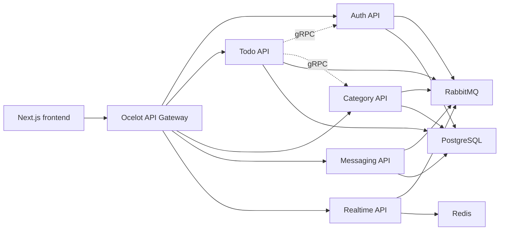

# Planora Architecture

This root file is the short architecture summary. The full reference is [`docs/architecture.md`](docs/architecture.md).

## Summary

Planora is a .NET 9 microservice backend with a Next.js 15 frontend:

- `frontend/` - browser UI and API client. Next.js 15 App Router; global animated canvas background (`TopologyLayer`) in the root layout; Zustand auth store; Tailwind + Radix UI + Framer Motion.
- `Planora.ApiGateway/` - Ocelot ingress, route map, JWT validation, health routing.
- `Services/AuthApi/` - users, roles, sessions, refresh tokens, email verification, password reset, 2FA, friendships, analytics intake.
- `Services/TodoApi/` - todos, shares, hidden state, viewer preferences, category enrichment.
- `Services/CategoryApi/` - user-owned categories.
- `Services/MessagingApi/` - direct messages.
- `Services/RealtimeApi/` - SignalR notifications and connection tracking.
- `BuildingBlocks/` - shared domain/application/infrastructure primitives.
- `GrpcContracts/` - service-to-service contracts.

## Confirmed Runtime Shape

## Core Decisions

Architecture decision records live in [`docs/DECISIONS/`](docs/DECISIONS/):

- microservices and database-per-service ownership;
- httpOnly refresh cookies;
- CSRF double-submit cookie;
- viewer-specific hidden shared todo visibility.

## Read More

- [`docs/architecture.md`](docs/architecture.md) - full architecture and data flow.
- [`docs/codebase-map.md`](docs/codebase-map.md) - directory and critical file map.
- [`docs/database.md`](docs/database.md) - persistence model.
- [`docs/auth-security.md`](docs/auth-security.md) - authentication and security.
