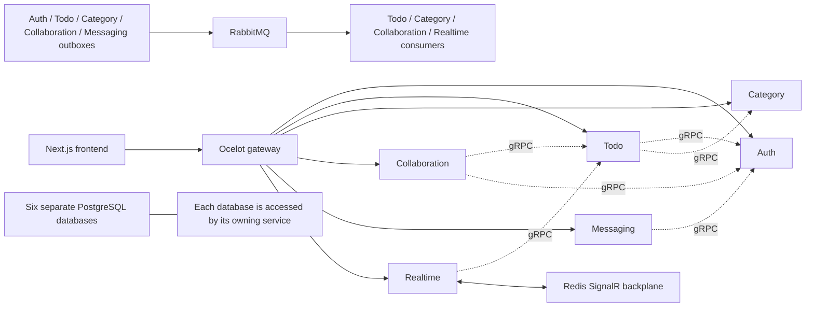

# Planora Architecture

The complete runtime reference is [docs/architecture.md](docs/architecture.md).
This page is a navigation guide to the implementation.

## Summary

Planora has a Next.js 16 frontend, an Ocelot gateway, and six .NET 10 domain services:

| Boundary | Responsibility | Persistence |
|---|---|---|
| `frontend/` | App Router UI, authenticated HTTP client, task branches, keyboard workflows and live reconciliation | Browser auth metadata/preferences; access token in memory |
| `Planora.ApiGateway/` | Browser ingress, route mapping, JWT validation, CORS and IP rate limiting | No domain database |
| `Services/AuthApi/` | Accounts, roles, sessions, verification/reset, 2FA, friendships and analytics intake | `planora_auth_db` |
| `Services/TodoApi/` | Tasks/subtasks, tags, shares, workers, viewer preferences and lifecycle events | `planora_todo` |
| `Services/CategoryApi/` | User-owned category definitions | `planora_category` |
| `Services/CollaborationApi/` | User/system/reply comments; synthesizes the Author's Note from Todo | `planora_collaboration` |
| `Services/MessagingApi/` | Direct messages between accepted friends | `planora_messaging` |
| `Services/RealtimeApi/` | SignalR notification/feed/branch/presence streams and notification read API | `planora_realtime` when configured; ephemeral fallback otherwise |

## Confirmed Runtime Shape

```mermaid
flowchart LR
  UI["Next.js frontend"] --> GW["Ocelot gateway"]
  GW --> Auth["Auth"]
  GW --> Todo["Todo"]
  GW --> Category["Category"]
  GW --> Collaboration["Collaboration"]
  GW --> Messaging["Messaging"]
  GW --> Realtime["Realtime"]
  Todo -. gRPC .-> Auth
  Todo -. gRPC .-> Category
  Collaboration -. gRPC .-> Todo
  Collaboration -. gRPC .-> Auth
  Messaging -. gRPC .-> Auth
  Realtime -. gRPC .-> Todo
  Producers["Auth / Todo / Category / Collaboration / Messaging outboxes"] --> Rabbit["RabbitMQ"]
  Rabbit --> Consumers["Todo / Category / Collaboration / Realtime consumers"]
  Realtime <--> Redis["Redis SignalR backplane"]
  Databases["Six separate PostgreSQL databases"] --- Services["Each database is accessed by its owning service"]
```

Integration events are delivered at least once with finite retry/dead-letter handling.
The active bus inbox is registered only in Collaboration. Notification rows are deduplicated
by source event ID when Realtime persistence is enabled. Transactional guarantees vary by
handler: outbox insertion can save immediately and domain-event dispatch can run after the
business commit. See [delivery semantics](docs/architecture.md#outbox-delivery-semantics)
for the precise boundaries and remaining reliability gaps.

## Shared Infrastructure

- `BuildingBlocks/`: domain/application primitives, MediatR behaviors, repositories,
  middleware, logging/telemetry/metrics, outbox/inbox, cache helpers, retention and health probes.
- `GrpcContracts/Protos/`: five server contracts; Auth, Category and Todo have in-repository clients.
- `tools/Planora.Migrator/`: schema runner for all six service contexts, plus Collaboration
  backfill/reply-column upgrade.
- `deploy/fly/`: hosting templates; [production prerequisites](docs/production.md) record
  the current pipeline and schema blockers.
- `perf/`: load-test scenarios and measurement instructions.

## Core Decisions And Verification

[ADRs](docs/DECISIONS/) preserve the architecture decisions and their later implementation notes.
[INVARIANTS.md](docs/INVARIANTS.md) distinguishes intended rules from current enforcement gaps.

The current Todo migration chain lacks its initial schema migration, so a clean empty Todo
database is not supported by the tracked chain alone. Realtime's delivery-audit entity is a
scaffold; hub reconnect does not replay missed notification toasts. These limitations are
documented in [database.md](docs/database.md) and [architecture.md](docs/architecture.md).

## Read More

- [Codebase map](docs/codebase-map.md)
- [Product overview](docs/overview.md)
- [Feature behavior](docs/features.md)
- [Database schema and migration governance](docs/database.md)
- [Authentication and security](docs/auth-security.md)
- [Development setup](docs/getting-started.md)
- [Operations](docs/OPERATIONS.md)
- [Deployment](docs/deployment.md)
