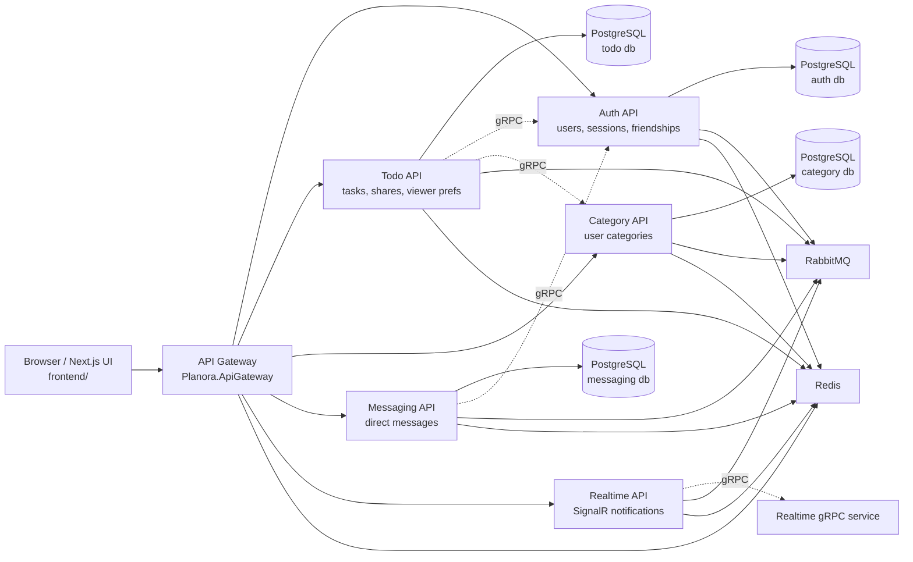
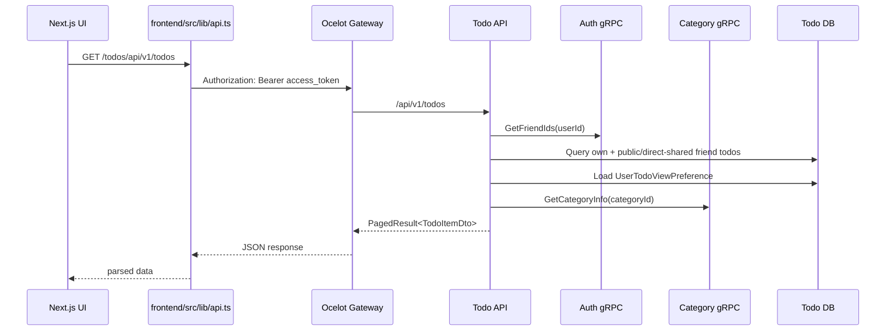
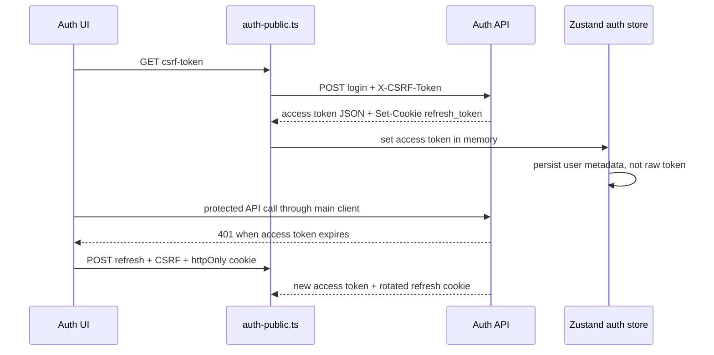

# Architecture

Planora is a microservice-oriented .NET 9 backend with a Next.js 15 frontend. The system uses database-per-service ownership, Ocelot for browser ingress, gRPC for synchronous service-to-service checks, RabbitMQ for asynchronous integration events, Redis for cache/backplane concerns, and PostgreSQL for persistent data.

## System Diagram



## Runtime Entry Points

| Entry point | Role | Code |
|---|---|---|
| Frontend | browser UI, auth state, API client, CSRF bootstrap | `frontend/src/app`, `frontend/src/lib/api.ts`, `frontend/src/store/auth.ts` |
| Gateway | Ocelot routing, JWT validation, rate limiting, health, CORS | `Planora.ApiGateway/Program.cs`, `Planora.ApiGateway/ocelot*.json` |
| Auth API | authentication, users, sessions, roles, friendships, analytics | `Services/AuthApi/Planora.Auth.Api/Program.cs`, `Controllers` |
| Todo API | todos, sharing, hidden state, viewer categories | `Services/TodoApi/Planora.Todo.Api/Program.cs`, `Controllers/TodosController.cs` |
| Category API | category CRUD and category gRPC | `Services/CategoryApi/Planora.Category.Api/Program.cs` |
| Messaging API | direct message HTTP/gRPC | `Services/MessagingApi/Planora.Messaging.Api/Program.cs` |
| Realtime API | SignalR notification hub and notification controllers | `Services/RealtimeApi/Planora.Realtime.Api/Program.cs` |

## Service Boundaries

| Service | Owns | Does not own |
|---|---|---|
| Auth | users, roles, user roles, refresh tokens, login history, password history, friendships, audit logs, auth outbox/inbox | todos, categories, messages |
| Todo | todo items, tags, todo shares, viewer preferences | user profiles, category definitions, friendship source of truth |
| Category | categories | todo assignments beyond category id references |
| Messaging | messages and messaging outbox/inbox | friendship ownership |
| Realtime | SignalR connections, notification fan-out, Redis backplane | durable notification database |
| Gateway | public route mapping and ingress concerns | domain rules |

## Backend Layering

Most backend services follow this shape:

```text
Api
  Controllers, Program.cs, gRPC services
Application
  CQRS commands/queries, validators, DTOs, handlers, mappings
Domain
  entities, value objects, domain events, enums, domain exceptions
Infrastructure
  EF Core DbContext/configurations/repositories, external clients, event handlers
```

Shared primitives live in `BuildingBlocks`:

| Building block | Purpose |
|---|---|
| `Planora.BuildingBlocks.Domain` | `Result`, `Error`, base entities, domain exceptions |
| `Planora.BuildingBlocks.Application` | CQRS abstractions, pagination, validation behavior, business event logging interface |
| `Planora.BuildingBlocks.Infrastructure` | middleware, repositories, logging, Redis/RabbitMQ, outbox/inbox, JWT extensions, health helpers |

## Request Flow: Authenticated Todo List



Code:

- `frontend/src/app/todos/page.tsx`
- `frontend/src/lib/api.ts`
- `Services/TodoApi/Planora.Todo.Api/Controllers/TodosController.cs`
- `Services/TodoApi/Planora.Todo.Application/Features/Todos/Queries/GetUserTodos/GetUserTodosQueryHandler.cs`
- `GrpcContracts/Protos/auth.proto`
- `GrpcContracts/Protos/category.proto`

## Request Flow: Login And Refresh



Startup uses `getCsrfToken()` to reuse an existing readable CSRF cookie, and the CSRF helper shares concurrent token fetches. `auth-public.ts` also serializes concurrent refresh calls and retries one CSRF `403` with a fresh readable token so page reloads do not race CSRF or refresh-token rotation.

Code:

- `Services/AuthApi/Planora.Auth.Api/Controllers/AuthenticationController.cs`
- `frontend/src/lib/auth-public.ts`
- `frontend/src/store/auth.ts`
- `frontend/src/lib/csrf.ts`
- `docs/DECISIONS/0002-http-only-refresh-cookies.md`
- `docs/DECISIONS/0003-csrf-double-submit.md`

## Data Ownership And Integration

### Synchronous gRPC

gRPC contracts are in `GrpcContracts/Protos`.

| Contract | Used for |
|---|---|
| `auth.proto` | token/user/friend checks for service boundaries |
| `category.proto` | category lookup and validation from Todo |
| `messaging.proto` | messaging service contract |
| `realtime.proto` | notification delivery contract |
| `todo.proto` | todo service contract |

Confirmed cross-service checks:

- Todo checks friendship through Auth before exposing public/direct-shared friend todos or accepting shared users.
- Todo asks Category for category metadata and category ownership.
- Messaging has Auth-related gRPC support in service configuration.

### Asynchronous RabbitMQ

RabbitMQ is configured through `BuildingBlocks/Planora.BuildingBlocks.Infrastructure/Messaging` and service `Program.cs` startup code. Confirmed subscriptions include:

| Subscriber | Event |
|---|---|
| Todo API | `CategoryDeletedIntegrationEvent`, `UserDeletedIntegrationEvent` |
| Category API | `UserDeletedIntegrationEvent` |
| Realtime API | `NotificationEvent` |

Code:

- `Services/TodoApi/Planora.Todo.Api/Program.cs`
- `Services/CategoryApi/Planora.Category.Api/Program.cs`
- `Services/RealtimeApi/Planora.Realtime.Api/Program.cs`
- `BuildingBlocks/Planora.BuildingBlocks.Infrastructure/Messaging`

## API Response Model

Backend handlers commonly return `Result<T>` or `PagedResult<T>`. `ResultToActionResultFilter` converts some `Result` values to HTTP responses, while some controllers return raw `Ok(result)` directly.

Frontend code handles both direct values and wrapped responses:

- `frontend/src/lib/api.ts:parseApiResponse`
- `frontend/src/types/category.ts:toCategoryList`

This matters for API consumers: category list responses are returned as a wrapper from `CategoriesController.GetCategories`, while some auth endpoints return anonymous JSON objects directly.

## Error Handling

Most services use `UseEnhancedGlobalExceptionHandling()`, which maps exceptions into a structured `ApiResponse<object>.Failed(...)` JSON response.

Important mappings:

| Exception/status | Response behavior |
|---|---|
| validation exception | `400` |
| domain exception | mapped by domain exception context |
| unauthorized access exception | `401` |
| timeout / external HTTP timeout | `503` |
| gRPC `NotFound` | `404` |
| gRPC `PermissionDenied` | `403` |
| gRPC `Unavailable` / `ResourceExhausted` | `503` |
| EF concurrency exception | `409` |
| operation canceled | `499` |

Code:

- `BuildingBlocks/Planora.BuildingBlocks.Infrastructure/Middleware/EnhancedGlobalExceptionMiddleware.cs`
- `tests/Planora.ErrorHandlingTests`

## Security Architecture

Security is split across frontend, gateway, and services:

- access token is kept in memory by `frontend/src/store/auth.ts`;
- refresh token is an httpOnly SameSite Strict cookie set by Auth API;
- state-changing browser requests require double-submit CSRF;
- each service validates JWT issuer/audience/signature locally;
- gateway validates bearer tokens for protected routes;
- CORS uses explicit origins with credentials;
- security headers are set by backend middleware and frontend `next.config.js`;
- passwords are hashed through BCrypt and checked with configurable strength rules.

Detailed security documentation: [`auth-security.md`](auth-security.md).

## Architecture Decisions

ADRs are stored in [`DECISIONS/`](DECISIONS/):

- `0001-microservices.md` - microservices and database-per-service.
- `0002-http-only-refresh-cookies.md` - refresh token storage.
- `0003-csrf-double-submit.md` - CSRF model.
- `0004-viewer-specific-todo-visibility.md` - hidden shared task privacy.

## Known Architectural Risks

| Risk | Why it matters | Current mitigation / note |
|---|---|---|
| Multiple response shapes | Frontend consumers must handle raw DTOs, `Result<T>`, and paged wrappers. | `parseApiResponse` handles common wrappers. |
| Configuration drift between launch profiles and Compose | Port/connection examples can become stale. | Prefer Compose/appsettings/Ocelot as source of truth; see `configuration.md`. |
| Todo description max length mismatch | Validator allows 5000; EF column config is 2000. | Documented as a code inconsistency requiring reconciliation. |
| Realtime persistence absent | Notifications/connections are not durably stored in a Realtime database. | Treat Realtime as fan-out/connection service unless code adds persistence. |
| Compose service ports are local-development bindings | Compose is a local topology, not a production edge design. | Keep databases, broker, cache, gRPC, and backend service ports private in production. |
