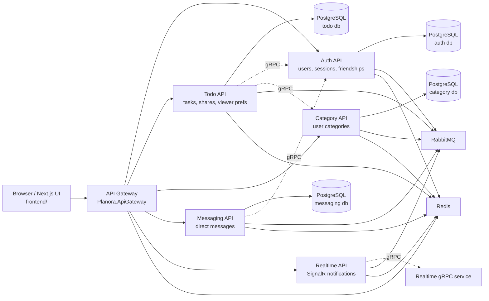
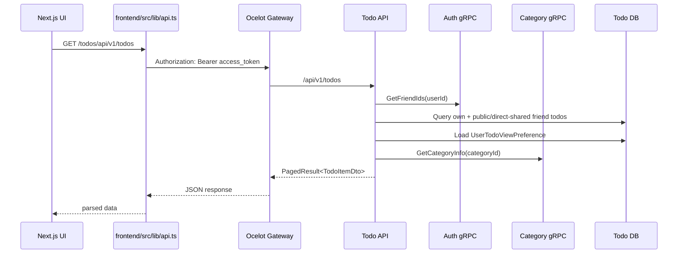
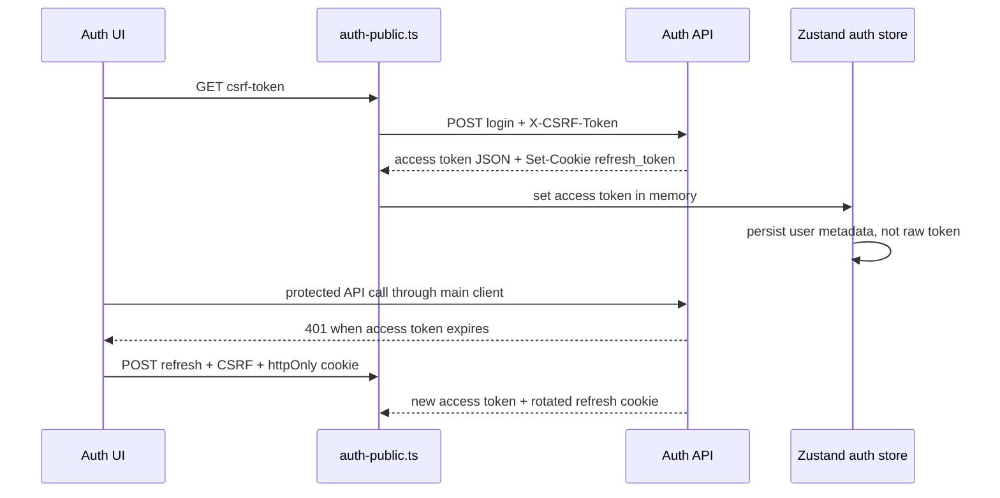

# Architecture

Planora is a microservice-oriented .NET 10 backend with a Next.js 16 frontend. The system uses database-per-service ownership, Ocelot for browser ingress, gRPC for synchronous service-to-service checks, RabbitMQ for asynchronous integration events, Redis for cache/backplane concerns, and PostgreSQL for persistent data.

## System Diagram



## Runtime Entry Points

| Entry point | Role | Code |
|---|---|---|
| Frontend | browser UI, auth state, API client, CSRF bootstrap | `frontend/src/app`, `frontend/src/lib/api.ts`, `frontend/src/store/auth.ts` |
| Gateway | Ocelot routing, JWT validation, rate limiting, health, CORS | `Planora.ApiGateway/Program.cs`, `Planora.ApiGateway/ocelot*.json` |
| Auth API | authentication, users, sessions, roles, friendships, analytics | `Services/AuthApi/Planora.Auth.Api/Program.cs`, `Controllers` |
| Todo API | todos, sharing, hidden state, viewer categories | `Services/TodoApi/Planora.Todo.Api/Program.cs`, `Controllers/TodosController.cs` |
| Category API | category CRUD and category gRPC | `Services/CategoryApi/Planora.Category.Api/Program.cs` |
| Messaging API | direct message HTTP/gRPC | `Services/MessagingApi/Planora.Messaging.Api/Program.cs` |
| Collaboration API | task comment timeline ("ветки"): user/genesis/system comments + comment notifications | `Services/CollaborationApi/Planora.Collaboration.Api/Program.cs`, `Controllers/CommentsController.cs` |
| Realtime API | SignalR notification hub and notification controllers | `Services/RealtimeApi/Planora.Realtime.Api/Program.cs` |

## Service Boundaries

| Service | Owns | Does not own |
|---|---|---|
| Auth | users, roles, user roles, refresh tokens, login history, password history, friendships, audit logs, auth outbox/inbox | todos, categories, messages |
| Todo | todo items, tags, todo shares, viewer preferences, task-lifecycle outbox | user profiles, category definitions, friendship source of truth, comment timeline |
| Category | categories | todo assignments beyond category id references |
| Messaging | messages and messaging outbox/inbox | friendship ownership |
| Collaboration | task comment timeline (user/genesis/system comments), comment notifications outbox | task aggregate, task access rules (delegated to Todo via gRPC), friendship source of truth |
| Realtime | SignalR connections, notification fan-out, Redis backplane | durable notification database |
| Gateway | public route mapping and ingress concerns | domain rules |

## Backend Layering

Most backend services follow this shape:

```text
Api
  Controllers, Program.cs, gRPC services
Application
  CQRS commands/queries, validators, DTOs, handlers, mappings
Domain
  entities, value objects, domain events, enums, domain exceptions
Infrastructure
  EF Core DbContext/configurations/repositories, external clients, event handlers
```

Shared primitives live in `BuildingBlocks`:

| Building block | Purpose |
|---|---|
| `Planora.BuildingBlocks.Domain` | `Result`, `Error`, base entities, domain exceptions |
| `Planora.BuildingBlocks.Application` | CQRS abstractions, pagination, validation behavior, business event logging interface |
| `Planora.BuildingBlocks.Infrastructure` | middleware, repositories, logging, Redis/RabbitMQ, outbox/inbox, JWT extensions, health helpers |

## Request Flow: Authenticated Todo List



Code:

- `frontend/src/app/todos/page.tsx`
- `frontend/src/lib/api.ts`
- `Services/TodoApi/Planora.Todo.Api/Controllers/TodosController.cs`
- `Services/TodoApi/Planora.Todo.Application/Features/Todos/Queries/GetUserTodos/GetUserTodosQueryHandler.cs`
- `GrpcContracts/Protos/auth.proto`
- `GrpcContracts/Protos/category.proto`

## Request Flow: Login And Refresh



Startup uses `getCsrfToken()` to reuse an existing readable CSRF cookie, and the CSRF helper shares concurrent token fetches. `auth-public.ts` also serializes concurrent refresh calls and retries one CSRF `403` with a fresh readable token so page reloads do not race CSRF or refresh-token rotation.

Code:

- `Services/AuthApi/Planora.Auth.Api/Controllers/AuthenticationController.cs`
- `frontend/src/lib/auth-public.ts`
- `frontend/src/store/auth.ts`
- `frontend/src/lib/csrf.ts`
- `docs/DECISIONS/0002-http-only-refresh-cookies.md`
- `docs/DECISIONS/0003-csrf-double-submit.md`

## Data Ownership And Integration

### Synchronous gRPC

gRPC contracts are in `GrpcContracts/Protos`.

| Contract | Used for |
|---|---|
| `auth.proto` | token/user/friend checks for service boundaries |
| `category.proto` | category lookup and validation from Todo |
| `messaging.proto` | messaging service contract |
| `realtime.proto` | notification delivery contract |
| `todo.proto` | todo service contract |

Confirmed cross-service checks:

- Todo checks friendship through Auth before exposing public/direct-shared friend todos or accepting shared users.
- Todo asks Category for category metadata and category ownership.
- Collaboration authorises every comment read/write through `TodoService.CheckTaskCommentAccess` (owner / shared / public + friendship), so it never reads Todo's database (INV-OWN-1) and never duplicates the sharing rules.
- Collaboration validates **subtask reply targets** through `TodoService.GetSubtaskBrief` (exists / not deleted / child of exactly this task) and snapshots the returned title + author on the reply — the parent/child check stays where the task aggregate lives (INV-OWN-1), and the client can never forge a quote.
- Collaboration batch-fetches current user avatar URLs from Auth (`GetUserAvatarsBatch` gRPC) when serving comment threads. Live enrichment is wrapped by `CachingUserService` (in-memory, 60 s TTL) so paged comment reads stay cheap while bounding staleness after a user changes their avatar.
- Todo batch-fetches subtask author identity (name + avatar) from Auth (`GetUserProfilesBatch`) when listing subtasks, so the branch's subtask cards show a live byline; the lookup is failure-tolerant (labels go empty, the read never fails).
- Messaging has Auth-related gRPC support in service configuration.

### Asynchronous RabbitMQ

RabbitMQ contracts (`IEventBus`, `IIntegrationEventHandler`, `IntegrationEvent`, integration events) live in `BuildingBlocks/Planora.BuildingBlocks.Application/Messaging` and `.../Events`. The RabbitMQ implementation (`RabbitMqEventBus`, `RabbitMqConnectionManager`) and the connection lifecycle remain in `BuildingBlocks/Planora.BuildingBlocks.Infrastructure/Messaging` and are wired in service `Program.cs` startup code. Confirmed subscriptions include:

| Subscriber | Event |
|---|---|
| Todo API | `CategoryDeletedIntegrationEvent`, `UserDeletedIntegrationEvent`, `FriendshipRemovedIntegrationEvent` |
| Category API | `UserDeletedIntegrationEvent` |
| Collaboration API | `TaskCreatedIntegrationEvent`, `TaskActivityIntegrationEvent`, `TaskDeletedIntegrationEvent`, `SubtaskDeletedIntegrationEvent`, `UserDeletedIntegrationEvent` |
| Realtime API | `NotificationEvent`, `RealtimeSyncIntegrationEvent` |

Publishers via outbox:

- Todo publishes `TaskCreated` / `TaskActivity` / `TaskDeleted` on task lifecycle (create, complete/start/leave, delete) — these drive the Collaboration timeline instead of the old in-transaction comment writes.
- Collaboration publishes `NotificationEvent` per participant when a comment is added; Realtime delivers it over SignalR.
- Todo and Collaboration publish `RealtimeSyncIntegrationEvent` on every task/comment mutation; Realtime fans it out over SignalR for live UI sync (see below).

### Live UI sync (SignalR)

Every client holds one SignalR connection to the unified hub (`/hubs/notifications`, reached as
`/realtime/hubs/notifications` through the gateway, WebSockets with the JWT in `?access_token=`).
The hub multiplexes three streams over that one socket:

| Stream | Server → client | Mechanism |
|---|---|---|
| Notifications | `ReceiveNotification` | per-user `user:{id}` group, from `NotificationEvent` |
| Feed sync | `TaskFeedChanged` | per-user `user:{id}` group, from `RealtimeSyncIntegrationEvent` (feed scope) |
| Branch sync | `BranchChanged` | per-task `task:{id}` room, from `RealtimeSyncIntegrationEvent` (branch scope) |
| Typing | `UserTyping` / `UserStoppedTyping` | per-task room, ephemeral (never persisted) |

The Notifications stream is **durable**: RealtimeApi persists each `NotificationEvent` to its
read-model (`RealtimeDbContext`, idempotent on the event id) before pushing, so an offline recipient
is caught up on reconnect and the UI can query unread counts (`/notifications/summary`) for per-card
dots, per-branch badges and the header bell. The actor who triggered an event is always excluded by
the producer (`NotificationFanout`), and the author-only review milestones (`task.review` /
`task.participants_done`) fire when every collaborator has finished. See `docs/features.md` →
Realtime Notifications.

`RealtimeSyncIntegrationEvent` carries the feed audience (resolved by the producing service: owner +
shared-with + the owner's accepted friends when public) and/or a branch task id. RealtimeApi only
routes — it makes no authorization decision. Branch rooms are joined via the hub's `JoinTask`, which
authorizes against TodoApi's `CheckTaskCommentAccess` gRPC and fails closed. Payloads are thin
id+action signals; the client refetches through authorized endpoints to reconcile, so a signal never
carries readable content. The Redis backplane fans group sends across all RealtimeApi instances.

Code: `Services/RealtimeApi/Planora.Realtime.Infrastructure/Hubs/NotificationHub.cs`,
`Services/RealtimeApi/Planora.Realtime.Infrastructure/Services/RealtimeBroadcaster.cs`,
`Services/RealtimeApi/Planora.Realtime.Application/Handlers/RealtimeSyncEventHandler.cs`,
`frontend/src/lib/realtime/client.ts` + `hooks.ts`.

Code:

- `Services/TodoApi/Planora.Todo.Api/Program.cs`
- `Services/CategoryApi/Planora.Category.Api/Program.cs`
- `Services/CollaborationApi/Planora.Collaboration.Api/Program.cs`
- `Services/RealtimeApi/Planora.Realtime.Api/Program.cs`
- `BuildingBlocks/Planora.BuildingBlocks.Application/Messaging` (contracts + events)
- `BuildingBlocks/Planora.BuildingBlocks.Infrastructure/Messaging` (RabbitMQ implementation)

## API Response Model

Backend handlers commonly return `Result<T>` or `PagedResult<T>`. `ResultToActionResultFilter` converts some `Result` values to HTTP responses, while some controllers return raw `Ok(result)` directly.

Frontend code handles both direct values and wrapped responses:

- `frontend/src/lib/api.ts:parseApiResponse`
- `frontend/src/types/category.ts:toCategoryList`

This matters for API consumers: category list responses are returned as a wrapper from `CategoriesController.GetCategories`, while some auth endpoints return anonymous JSON objects directly.

## Error Handling

Most services use `UseEnhancedGlobalExceptionHandling()`, which maps exceptions into a structured `ApiResponse<object>.Failed(...)` JSON response.

Important mappings:

| Exception/status | Response behavior |
|---|---|
| validation exception | `400` |
| domain exception | mapped by domain exception context |
| unauthorized access exception | `401` |
| timeout / external HTTP timeout | `503` |
| gRPC `NotFound` | `404` |
| gRPC `PermissionDenied` | `403` |
| gRPC `Unavailable` / `ResourceExhausted` | `503` |
| EF concurrency exception | `409` |
| operation canceled | `499` |

Code:

- `BuildingBlocks/Planora.BuildingBlocks.Infrastructure/Middleware/EnhancedGlobalExceptionMiddleware.cs`
- `tests/Planora.ErrorHandlingTests`

## Security Architecture

Security is split across frontend, gateway, and services:

- access token is kept in memory by `frontend/src/store/auth.ts`;
- refresh token is an httpOnly SameSite Strict cookie set by Auth API;
- state-changing browser requests require double-submit CSRF;
- each service validates JWT issuer/audience/signature locally;
- gateway validates bearer tokens for protected routes;
- CORS uses explicit origins with credentials;
- security headers are set by backend middleware and frontend `next.config.js`;
- passwords are hashed through BCrypt and checked with configurable strength rules.

Detailed security documentation: [`auth-security.md`](auth-security.md).

## Observability Architecture

Observability is a first-class, cross-cutting concern wired identically in every service through a single shared extension. The pipeline is **safe-by-default**: if no OTLP endpoint is configured, the spans and metrics are still produced in-process but no exporter is registered, so there are no background connections, no log noise, and no need to reconfigure environments before merging telemetry-related changes.

- **Tracing pipeline** — `BuildingBlocks.Infrastructure.Logging.TelemetryConfiguration.AddPlanoraTelemetry(IConfiguration, defaultServiceName)` registers ASP.NET Core request tracing (with a `/health*` filter that suppresses probe noise), HttpClient tracing (covers gRPC-over-HTTP/2 transport), and Entity Framework Core tracing. The wildcard `Planora.*` subscription auto-discovers any service-defined `ActivitySource`.
- **Metrics pipeline** — same extension wires ASP.NET Core request metrics, HttpClient metrics, and .NET runtime metrics (GC, threadpool, exceptions, working set). Custom counters and histograms published through `BuildingBlocks.Infrastructure.Observability.PlanoraMetrics` (Meter name `Planora.BuildingBlocks`) are auto-discovered through the same wildcard.
- **Custom Planora instruments** (`PlanoraMetrics.cs`):
  - `planora.csrf.rejections{reason}` — populated by `CsrfProtectionMiddleware`. Reasons: `missing_header`, `missing_cookie`, `mismatch`.
  - `planora.grpc.unauthenticated{reason}` — populated by `ServiceKeyServerInterceptor`. Reasons: `missing_key`, `short_key`, `mismatch`.
  - `planora.outbox.messages{outcome}` — populated by `OutboxProcessor`. Outcomes: `processed`, `failed`, `type_not_found`, `deserialize_failed`, `retry_exhausted`.
  - `planora.outbox.batch.duration` (histogram, seconds) — wall-clock per outbox pass.
  - `planora.outbox.message.age` (histogram, seconds) — `now - OccurredOnUtc` at the moment the processor picks the row up; the canonical backpressure signal.
- **Resource attributes** — every span and metric carries `service.name`, `service.version` (from the entry-assembly version), `service.instance.id` (machine hostname), `service.namespace=planora`, and `deployment.environment` (from `ASPNETCORE_ENVIRONMENT`).
- **Configuration keys** — `OpenTelemetry:OtlpEndpoint` (or the standard `OTEL_EXPORTER_OTLP_ENDPOINT` env var), `OpenTelemetry:ServiceName` / `ServiceVersion`, `OpenTelemetry:ConsoleExporter:Enabled` (debug only), `OpenTelemetry:Tracing:Enabled` / `Metrics:Enabled` (kill switches), `OpenTelemetry:Tracing:CaptureDbStatementText` (PII control on EF SQL capture). Full catalogue in [`configuration.md`](configuration.md).
- **Logs** — Serilog enrichers from `BuildingBlocks.Infrastructure.Logging` populate `CorrelationId`, `SpanId`, `OperationName`, `UserId`, and `ServiceName` on every log line.

## Health Probe Architecture

Every service and the Gateway publish three health-probe endpoints through a single extension `BuildingBlocks.Infrastructure.Extensions.HealthCheckExtensions.MapPlanoraHealthEndpoints(IEndpointRouteBuilder)`:

| Endpoint | Tag matched | Orchestrator action on failure |
|---|---|---|
| `/health/live` | `live` (vacuously healthy when no `live` checks are registered) | restart the machine — the process is wedged |
| `/health/ready` | `ready` (e.g. `AddDatabaseHealthCheck` tags Npgsql probes with `ready`) | hold traffic off this instance until dependencies recover |
| `/health` | (no predicate — aggregate of every registered check) | retained for backwards-compatible consumers (docker-compose healthchecks, ad-hoc curl) |

Liveness and readiness are deliberately distinct: an aggregate `/health` cannot distinguish "process dead — restart me" from "process alive but Postgres is slow — do not route to me yet". Fly.io's `[[http_service.checks]]` blocks point at the two split endpoints (`deploy/fly/*.fly.toml`).

## Architecture Decisions

ADRs are stored in [`DECISIONS/`](DECISIONS/):

- `0001-microservices.md` - microservices and database-per-service.
- `0002-http-only-refresh-cookies.md` - refresh token storage.
- `0003-csrf-double-submit.md` - CSRF model.
- `0004-viewer-specific-todo-visibility.md` - hidden shared task privacy.

## Known Architectural Risks

| Risk | Why it matters | Current mitigation / note |
|---|---|---|
| Multiple response shapes | Frontend consumers must handle raw DTOs, `Result<T>`, and paged wrappers. | `parseApiResponse` handles common wrappers. |
| Configuration drift between launch profiles and Compose | Port/connection examples can become stale. | Prefer Compose/appsettings/Ocelot as source of truth; see `configuration.md`. |
| Realtime persistence absent | Notifications/connections are not durably stored in a Realtime database. | Treat Realtime as fan-out/connection service unless code adds persistence. |
| Realtime notification consumer is not deduped | `NotificationEvent` delivery is at-least-once, so a redelivered event can re-push a SignalR notification (a duplicate transient toast). | Intentional: Realtime is a stateless SignalR fan-out with no DB write, so persistent inbox dedup (used by Collaboration) would be disproportionate. The event-bus dedup is graceful — it simply no-ops here. |
| Compose service ports are local-development bindings | Compose is a local topology, not a production edge design. | Keep databases, broker, cache, gRPC, and backend service ports private in production. |
