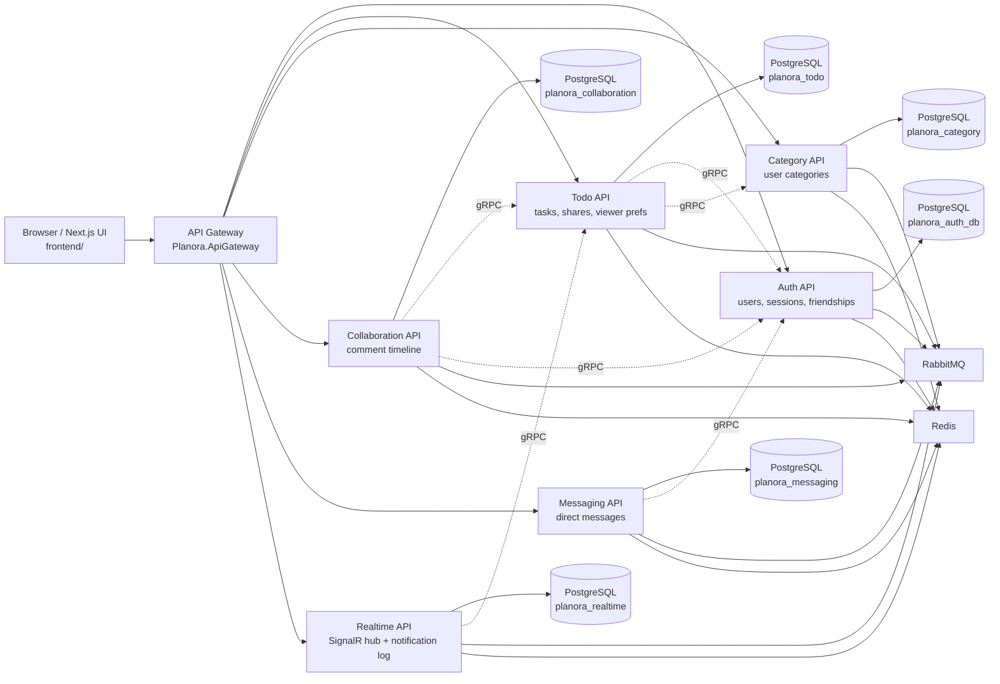
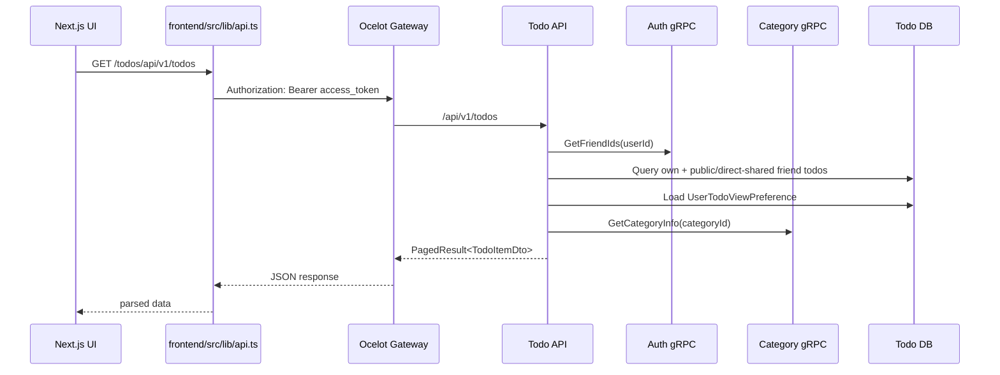
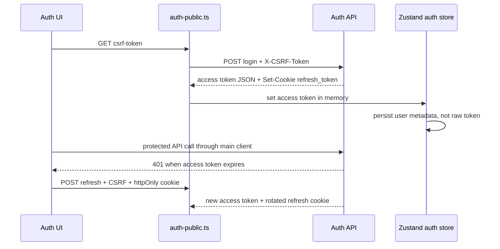

# Architecture

Planora is a microservice-oriented .NET 10 backend with a Next.js 16 frontend. The system uses database-per-service ownership, Ocelot for browser ingress, gRPC for synchronous service-to-service checks, RabbitMQ for asynchronous integration events, Redis for cache/backplane concerns, and PostgreSQL for persistent data.

## System Diagram


```mermaid
flowchart LR
  Browser["Browser / Next.js UI\nfrontend/"] --> Gateway["API Gateway\nPlanora.ApiGateway"]

  Gateway --> Auth["Auth API\nusers, sessions, friendships"]
  Gateway --> Todo["Todo API\ntasks, shares, viewer prefs"]
  Gateway --> Category["Category API\nuser categories"]
  Gateway --> Collaboration["Collaboration API\ncomment timeline"]
  Gateway --> Messaging["Messaging API\ndirect messages"]
  Gateway --> Realtime["Realtime API\nSignalR hub + notification log"]

  Auth --> AuthDb[("PostgreSQL\nplanora_auth_db")]
  Todo --> TodoDb[("PostgreSQL\nplanora_todo")]
  Category --> CategoryDb[("PostgreSQL\nplanora_category")]
  Collaboration --> CollaborationDb[("PostgreSQL\nplanora_collaboration")]
  Messaging --> MessagingDb[("PostgreSQL\nplanora_messaging")]
  Realtime --> RealtimeDb[("PostgreSQL\nplanora_realtime")]

  Todo -. gRPC .-> Auth
  Todo -. gRPC .-> Category
  Collaboration -. gRPC .-> Todo
  Collaboration -. gRPC .-> Auth
  Messaging -. gRPC .-> Auth
  Realtime -. gRPC .-> Todo

  Auth --> Rabbit["RabbitMQ"]
  Todo --> Rabbit
  Category --> Rabbit
  Collaboration --> Rabbit
  Messaging --> Rabbit
  Realtime --> Rabbit

  Auth --> Redis["Redis"]
  Todo --> Redis
  Category --> Redis
  Collaboration --> Redis
  Messaging --> Redis
  Realtime --> Redis
```

The gateway is deliberately absent from the Redis and RabbitMQ edges: it is a pure Ocelot
reverse proxy with an in-process rate limiter and no event bus, so `docker-compose.yml`
sets neither `ConnectionStrings__Redis` nor `RabbitMq__*` on it.

## Runtime Entry Points

| Entry point | Role | Code |
|---|---|---|
| Frontend | browser UI, auth state, API client, CSRF bootstrap | `frontend/src/app`, `frontend/src/lib/api.ts`, `frontend/src/store/auth.ts` |
| Gateway | Ocelot routing, JWT validation, rate limiting, health, CORS | `Planora.ApiGateway/Program.cs`, `Planora.ApiGateway/ocelot*.json` |
| Auth API | authentication, users, sessions, roles, friendships, analytics | `Services/AuthApi/Planora.Auth.Api/Program.cs`, `Controllers` |
| Todo API | todos, sharing, hidden state, viewer categories | `Services/TodoApi/Planora.Todo.Api/Program.cs`, `Controllers/TodosController.cs` |
| Category API | category CRUD and category gRPC | `Services/CategoryApi/Planora.Category.Api/Program.cs` |
| Messaging API | direct message HTTP/gRPC | `Services/MessagingApi/Planora.Messaging.Api/Program.cs` |
| Collaboration API | task comment timeline: user/genesis/system comments + comment notifications | `Services/CollaborationApi/Planora.Collaboration.Api/Program.cs`, `Controllers/CommentsController.cs` |
| Realtime API | SignalR notification hub and notification controllers | `Services/RealtimeApi/Planora.Realtime.Api/Program.cs` |

## Service Boundaries

| Service | Owns | Does not own |
|---|---|---|
| Auth | users, roles, user roles, refresh tokens, login history, password history, friendships, audit logs, auth outbox/inbox | todos, categories, messages |
| Todo | todo items, tags, todo shares, viewer preferences, task-lifecycle outbox | user profiles, category definitions, friendship source of truth, comment timeline |
| Category | categories | todo assignments beyond category id references |
| Messaging | messages and messaging outbox/inbox | friendship ownership |
| Collaboration | task comment timeline (user/genesis/system comments), comment notifications outbox | task aggregate, task access rules (delegated to Todo via gRPC), friendship source of truth |
| Realtime | SignalR connections, notification fan-out, Redis backplane, the durable notification read-model (`planora_realtime`) | task/comment content — payloads are id+action signals, and the client refetches through the owning service |
| Gateway | public route mapping and ingress concerns | domain rules |

## Backend Layering

Most backend services follow this shape:

```text
Api
  Controllers, Program.cs, gRPC services
Application
  CQRS commands/queries, validators, DTOs, handlers, mappings
Domain
  entities, value objects, domain events, enums, domain exceptions
Infrastructure
  EF Core DbContext/configurations/repositories, external clients, event handlers
```

Shared primitives live in `BuildingBlocks`:

| Building block | Purpose |
|---|---|
| `Planora.BuildingBlocks.Domain` | `Result`, `Error`, base entities, domain exceptions |
| `Planora.BuildingBlocks.Application` | CQRS abstractions, pagination, validation behavior, business event logging interface |
| `Planora.BuildingBlocks.Infrastructure` | middleware, repositories, logging, Redis/RabbitMQ, outbox/inbox, JWT extensions, health helpers |

## Browser Ingress

Every browser request reaches exactly one origin — the gateway (`http://127.0.0.1:5132`
locally, `http://api-gateway:80` inside Compose). Nothing else is meant to be reachable from a
browser; the Compose port publications for the services themselves are `127.0.0.1`-bound
development conveniences.

### Route prefixes

`ocelot.json` (local) and `ocelot.Docker.json` (Compose) hold the same route set against
different downstream hosts. The prefix is what the frontend's `getApiBaseUrl()` appends to:

| Upstream prefix | Downstream | Auth |
|---|---|---|
| `/auth/api/v1/auth/{…}` | Auth `/api/v1/Authentication/{…}` | anonymous — this is where login, refresh and the CSRF token live |
| `/auth/api/v1/users/{…}`, `/friendships`, `/auth/api/v1/analytics/{…}` | Auth | `Bearer` (except `users/verify-email`, which arrives from an email link) |
| `/avatars/{…}` | Auth static files | anonymous |
| `/categories/api/v1/{…}` | Category | `Bearer` |
| `/todos/api/v1/{…}` | Todo | `Bearer` |
| `/collaboration/api/v1/{…}` | Collaboration | `Bearer` |
| `/messaging/api/v1/{…}` | Messaging | `Bearer` |
| `/realtime/api/v1/{…}` | Realtime | `Bearer` |
| `/realtime/{…}` | Realtime, `DownstreamScheme: ws` | `Bearer` |
| `/{service}/health` | that service's `/health` | anonymous |

The gateway validates issuer, audience, lifetime and signature itself, and the downstream
service validates the same token again — the gateway is a convenience, never the only check.
`/health*` is short-circuited with an inline `200` **before** `UseOcelot()`, because Ocelot's
terminal middleware owns the pipeline and has no downstream route for the gateway's own probes.

### Throttling and the Ocelot rate-limiter trap

Edge throttling is the ASP.NET Core rate limiter in `Program.cs`, not Ocelot's per-route
`RateLimitOptions` — every route in both ocelot files carries `EnableRateLimiting: false`.
Ocelot 24.x partitions by a `ClientId` request header and fail-closes with `503` when that
header is absent, which it always is for browser traffic; enabling it rejected every login,
refresh and SignalR connection. Two chained partitioned limiters replace it, both keyed on
`RemoteIpAddress`: 100 requests/minute for every gateway request, and a second 30/minute window
that only applies under `/auth/api/v1/auth` (preflights bypass it). A rejection is `429` with
`Retry-After: 60`.

That partitioning depends on seeing the real client IP. `UseForwardedHeaders` is registered
**only** when `ForwardedHeaders:KnownProxies` is non-empty: unconditional trust would let any
client spoof `X-Forwarded-For` and poison another user's bucket, while ignoring the header
behind an edge proxy collapses every client into one bucket. Outside Development with an empty
proxy list the gateway logs a warning at boot rather than failing silently.

### CORS

Two policies. `Production` is `WithOrigins(Cors:AllowedOrigins)`. The development `AllowAll`
policy accepts the configured origins plus any loopback or RFC1918 private-LAN origin, so a
phone on the same Wi-Fi can open the app at the host's LAN IP. It is a bounded predicate, not
`AllowAnyOrigin()` — that combination is rejected by browsers alongside `AllowCredentials()`,
which both policies set because the refresh cookie needs it.

### CSRF

The double-submit pair is a readable `XSRF-TOKEN` cookie and an `X-CSRF-Token` header that must
match, checked on `POST`/`PUT`/`DELETE`/`PATCH`. Requests with an `application/grpc*`
content type are exempt: the defence protects browser cookie flows, and the exemption is keyed
on content type rather than the old path-plus-HTTP/2 heuristic, which browsers could satisfy.
The mechanism is [ADR-0003](DECISIONS/0003-csrf-double-submit.md); the frontend half — token
bootstrap, the shared in-flight fetch, the single `403` retry — is in
[`frontend.md`](frontend.md) § 4 and `lib/csrf.ts`.

`app.UseCsrfProtection()` is currently registered in **Auth, Category, Todo, Collaboration and
Messaging**. Realtime and the gateway do not register it. ADR-0005 records an earlier, narrower
decision (Auth API only) and is out of date on this point; the invariant it protects —
no cookie credential outside Auth's `/auth/api/v1/auth` path scope — still holds.

### CSP and per-request rendering

`frontend/src/middleware.ts` mints a fresh nonce per request, sets the CSP on both the
**request** headers (Next.js reads it there to stamp the nonce onto its own inline bootstrap
scripts) and the **response** headers (the browser enforces it). Production `script-src` is
`'self' 'nonce-…'` with no `'unsafe-inline'`; `style-src` keeps `'unsafe-inline'` because
Tailwind and Next.js inject critical CSS as inline `<style>` during SSR. In production,
`connect-src` and `img-src` both carry the build-time API origin plus, for a loopback or private-LAN viewer, the
gateway on the host the page was opened from — which is what `getApiBaseUrl()` will actually
dial, and is not necessarily the origin baked at build time. `connect-src` additionally carries
each of those origins in its `ws://`/`wss://` form, because the SignalR hub is reached over a
WebSocket.

A nonce only works on HTML rendered per request, so `export const dynamic = "force-dynamic"` is
declared once, in `frontend/src/app/layout.tsx`, and cascades to the whole App Router. It is the
only such declaration in the tree — there are no per-segment overrides. The cost (no static
optimisation, no CDN HTML caching) and the sunset condition (hash-based CSP) are
[ADR-0006](DECISIONS/0006-force-dynamic-and-csp-nonce.md). The consequences for component
authors — two renders, no unpinned locale, no `Date.now()` in render — are in
[`frontend.md`](frontend.md) § 2.

## Request Flow: Authenticated Todo List


```mermaid
sequenceDiagram
  participant UI as Next.js UI
  participant API as frontend/src/lib/api.ts
  participant GW as Ocelot Gateway
  participant Todo as Todo API
  participant Auth as Auth gRPC
  participant Cat as Category gRPC
  participant DB as Todo DB

  UI->>API: GET /todos/api/v1/todos
  API->>GW: Authorization: Bearer access_token
  GW->>Todo: /api/v1/todos
  Todo->>Auth: GetFriendIds(userId)
  Todo->>DB: Query own + public/direct-shared friend todos
  Todo->>DB: Load UserTodoViewPreference
  Todo->>Cat: GetCategoryInfo(categoryId)
  Todo-->>GW: PagedResult<TodoItemDto>
  GW-->>API: JSON response
  API-->>UI: parsed data
```

Code:

- `frontend/src/app/tasks/page.tsx`
- `frontend/src/lib/api.ts`
- `Services/TodoApi/Planora.Todo.Api/Controllers/TodosController.cs`
- `Services/TodoApi/Planora.Todo.Application/Features/Todos/Queries/GetUserTodos/GetUserTodosQueryHandler.cs`
- `GrpcContracts/Protos/auth.proto`
- `GrpcContracts/Protos/category.proto`

## Request Flow: Login And Refresh


```mermaid
sequenceDiagram
  participant UI as Auth UI
  participant PublicClient as auth-public.ts
  participant Auth as Auth API
  participant Store as Zustand auth store

  UI->>PublicClient: GET csrf-token
  PublicClient->>Auth: POST login + X-CSRF-Token
  Auth-->>PublicClient: access token JSON + Set-Cookie refresh_token
  PublicClient->>Store: set access token in memory
  Store->>Store: persist user metadata, not raw token

  UI->>Auth: protected API call through main client
  Auth-->>UI: 401 when access token expires
  UI->>PublicClient: POST refresh + CSRF + httpOnly cookie
  Auth-->>PublicClient: new access token + rotated refresh cookie
```

Startup uses `getCsrfToken()` to reuse an existing readable CSRF cookie, and the CSRF helper shares concurrent token fetches. `auth-public.ts` also serializes concurrent refresh calls and retries one CSRF `403` with a fresh readable token so page reloads do not race CSRF or refresh-token rotation.

Code:

- `Services/AuthApi/Planora.Auth.Api/Controllers/AuthenticationController.cs`
- `frontend/src/lib/auth-public.ts`
- `frontend/src/store/auth.ts`
- `frontend/src/lib/csrf.ts`
- `docs/DECISIONS/0002-http-only-refresh-cookies.md`
- `docs/DECISIONS/0003-csrf-double-submit.md`

## Data Ownership And Integration

### Synchronous gRPC

gRPC contracts are in `GrpcContracts/Protos`.

All five services map a gRPC server (`app.MapGrpcService<…>`), but only four of the contracts
have an in-repo caller. `messaging.proto` and `realtime.proto` are served and never dialled —
the notification path to Realtime runs over RabbitMQ, not gRPC.

| Contract | Served by | Called by | Used for |
|---|---|---|---|
| `auth.proto` | Auth API | Todo, Collaboration, Messaging | friendship checks, batched user profiles and avatars |
| `category.proto` | Category API | Todo | category lookup and ownership validation |
| `todo.proto` | Todo API | Collaboration, Realtime | task access rules, subtask reply targets |
| `messaging.proto` | Messaging API | — | no in-repo client |
| `realtime.proto` | Realtime API | — | no in-repo client |

Every client is wired with `ServiceKeyClientInterceptor` and every server with
`ServiceKeyServerInterceptor`, so a call without the shared `x-service-key` is rejected
`Unauthenticated` and counted on `planora.grpc.unauthenticated{reason}` (INV-COMM-2).

Confirmed cross-service checks:

- Todo checks friendship through Auth before exposing public/direct-shared friend todos or accepting shared users.
- Todo asks Category for category metadata and category ownership.
- Collaboration authorises every comment read/write through `TodoService.CheckTaskCommentAccess` (owner / shared / public + friendship), so it never reads Todo's database (INV-OWN-1) and never duplicates the sharing rules.
- Collaboration validates **subtask reply targets** through `TodoService.GetSubtaskBrief` (exists / not deleted / child of exactly this task) and snapshots the returned title + author on the reply — the parent/child check stays where the task aggregate lives (INV-OWN-1), and the client can never forge a quote.
- Collaboration batch-fetches current user avatar URLs from Auth (`GetUserAvatarsBatch` gRPC) when serving comment threads. Live enrichment is wrapped by `CachingUserService` (in-memory, 60 s TTL) so paged comment reads stay cheap while bounding staleness after a user changes their avatar.
- Todo batch-fetches subtask author identity (name + avatar) from Auth (`GetUserProfilesBatch`) when listing subtasks, so the branch's subtask cards show a live byline; the lookup is failure-tolerant (labels go empty, the read never fails).
- Realtime authorises every branch-room join through the same `TodoService.CheckTaskCommentAccess`
  before adding the connection to the `task:{id}` group, and fails closed on an unknown or
  unauthorised id, so a client cannot subscribe its way into a task it may not read.
- Messaging calls `AuthService.AreFriends` in `SendMessageCommandHandler` before accepting a
  direct message, so the friendship rule stays in Auth rather than being copied into Messaging.

### Asynchronous RabbitMQ

RabbitMQ contracts (`IEventBus`, `IIntegrationEventHandler`, `IntegrationEvent`) live in
`BuildingBlocks/Planora.BuildingBlocks.Application/Messaging`, the integration-event types in
`.../Messaging/Events`. The RabbitMQ implementation (`RabbitMqEventBus`,
`RabbitMqConnectionManager`) and the connection lifecycle are in
`BuildingBlocks/Planora.BuildingBlocks.Infrastructure/Messaging`; the outbox drainer is next
door in `.../Infrastructure/Outbox`. Subscriptions are registered explicitly in each service's
`Program.cs`:

| Subscriber | Event |
|---|---|
| Todo API | `CategoryDeletedIntegrationEvent`, `UserDeletedIntegrationEvent`, `FriendshipRemovedIntegrationEvent` |
| Category API | `UserDeletedIntegrationEvent` |
| Collaboration API | `TaskCreatedIntegrationEvent`, `TaskActivityIntegrationEvent`, `TaskDeletedIntegrationEvent`, `SubtaskDeletedIntegrationEvent`, `UserDeletedIntegrationEvent` |
| Realtime API | `NotificationEvent`, `RealtimeSyncIntegrationEvent`, `TaskDeletedIntegrationEvent`, `UserDeletedIntegrationEvent` |

Auth and Messaging subscribe to nothing; they are publishers only.

Handlers are registered by their **concrete** type, not by `IIntegrationEventHandler<T>`.
`RabbitMqEventBus` resolves the handler captured at `SubscribeAsync<TEvent, THandler>` via
`GetService(concreteType)`; an interface-only registration returns null, the bus logs, skips —
and still ACKs the message, silently dropping every event of that type.

Publishers via outbox:

- Auth publishes `UserDeletedIntegrationEvent` on account deletion and `FriendshipRemovedIntegrationEvent` when a friendship is removed; the second is what makes Todo drop a share that friendship used to justify.
- Category publishes `CategoryDeletedIntegrationEvent` from the category domain-event handler, so Todo can detach the tasks that referenced it.
- Todo publishes `TaskCreated` / `TaskActivity` / `TaskDeleted` / `SubtaskDeleted` on task lifecycle (create, duplicate, complete/start/leave, delete) — these drive the Collaboration timeline instead of the old in-transaction comment writes.
- Todo publishes `NotificationEvent` through `NotificationFanout`, which excludes the actor who triggered the change so nobody is notified of their own action.
- Collaboration publishes `NotificationEvent` per participant when a comment is added; Realtime delivers it over SignalR.
- Messaging publishes `NotificationEvent` to the recipient when a message is sent; the row is written to the Messaging outbox in the same transaction as the message (it does not publish straight to the broker), and the shared `OutboxProcessor` ships it to Realtime.
- Todo and Collaboration publish `RealtimeSyncIntegrationEvent` on every task/comment mutation; Realtime fans it out over SignalR for live UI sync (see below).
- The Todo retention policy republishes `TaskDeletedIntegrationEvent` under a system actor id when it auto-deletes a long-completed task, so the cascade into Collaboration and Realtime is the same one a user delete takes.

### Outbox delivery semantics

Each service writes integration events to its own `outbox` table inside the same transaction as the
domain change (transactional outbox), and a background `OutboxProcessor` polls that table and publishes
to RabbitMQ. The guarantee is **at-least-once**: a process can crash after the broker publish but before
the row is marked `Processed`, so the event is re-published on the next pass. Consumers therefore **must
be idempotent** — the persistent inbox de-duplicates by event id (Auth, Messaging and Collaboration keep
an `inbox` table; Realtime instead de-dups against its own read-model, in
`NotificationEventHandler`, which persists before it pushes and returns early when the row already
exists, so a redelivery never produces a second toast).

Because delivery is at-least-once, the processor also runs a **crash-recovery sweep** at the start of
every pass: a worker that dies between `MarkAsProcessing` and `MarkAsProcessed` strands a row in
`Processing`, which the main query never re-selects. `ReclaimStuckProcessingAsync` returns any row that
has been `Processing` longer than a 5-minute lease back to `Pending` (consuming the retry budget, so a
message that crashes the worker on every attempt is eventually dead-lettered rather than looping). Without
this sweep a single crash silently drops the event.

The processor's `SELECT` of pending/failed rows is **claim-free**, which assumes **one active
`OutboxProcessor` instance per service** — the default deployment. Running two instances of the same
service would have both drain the same `Pending` rows and double-publish (still safe for consumers
because of idempotency, but wasteful). To scale a service horizontally while keeping a single logical
drainer, claim each batch atomically before processing — e.g. `SELECT … FOR UPDATE SKIP LOCKED` or a
guarded `UPDATE … SET Status = Processing … RETURNING` — so every row is owned by exactly one worker.
This is called out in `OutboxProcessor.ProcessOutboxMessagesAsync`.

### Live UI sync (SignalR)

Every client holds one SignalR connection to the unified hub (`/hubs/notifications`, reached as
`/realtime/hubs/notifications` through the gateway, WebSockets with the JWT in `?access_token=`).
The client builds that URL from `getApiBaseUrl()` and connects with `skipNegotiation: true` and
`transport: WebSockets`, so there is no negotiate round-trip and the token can only travel in the
query string — a browser cannot set an `Authorization` header on a WebSocket. The hub multiplexes
four streams over that one socket:

| Stream | Server → client | Mechanism |
|---|---|---|
| Notifications | `ReceiveNotification` | per-user `user:{id}` group, from `NotificationEvent` |
| Feed sync | `TaskFeedChanged` | per-user `user:{id}` group, from `RealtimeSyncIntegrationEvent` (feed scope) |
| Branch sync | `BranchChanged` | per-task `task:{id}` room, from `RealtimeSyncIntegrationEvent` (branch scope) |
| Typing | `UserTyping` / `UserStoppedTyping` | per-task room, ephemeral (never persisted) |

The Notifications stream is **durable**: RealtimeApi persists each `NotificationEvent` to its
read-model (`RealtimeDbContext`, idempotent on the event id) before pushing, so an offline recipient
is caught up on reconnect and the UI can query unread counts (`/notifications/summary`) for per-card
dots, per-branch badges and the header bell. The actor who triggered an event is always excluded by
the producer (`NotificationFanout`), and the author-only review milestones (`task.review` /
`task.participants_done`) fire when every collaborator has finished. See `docs/features.md` →
Realtime Notifications.

`RealtimeSyncIntegrationEvent` carries the feed audience (resolved by the producing service: owner +
shared-with + the owner's accepted friends when public) and/or a branch task id. RealtimeApi only
routes — it makes no authorization decision. Branch rooms are joined via the hub's `JoinTask`, which
authorizes against TodoApi's `CheckTaskCommentAccess` gRPC and fails closed. Payloads are thin
id+action signals; the client refetches through authorized endpoints to reconcile, so a signal never
carries readable content. The Redis backplane fans group sends across all RealtimeApi instances.

Code: `Services/RealtimeApi/Planora.Realtime.Infrastructure/Hubs/NotificationHub.cs`,
`Services/RealtimeApi/Planora.Realtime.Infrastructure/Services/RealtimeBroadcaster.cs`,
`Services/RealtimeApi/Planora.Realtime.Application/Handlers/RealtimeSyncEventHandler.cs`,
`frontend/src/lib/realtime/client.ts` + `hooks.ts`.

Code:

- `Services/TodoApi/Planora.Todo.Api/Program.cs`
- `Services/CategoryApi/Planora.Category.Api/Program.cs`
- `Services/CollaborationApi/Planora.Collaboration.Api/Program.cs`
- `Services/RealtimeApi/Planora.Realtime.Api/Program.cs`
- `BuildingBlocks/Planora.BuildingBlocks.Application/Messaging` (contracts + events)
- `BuildingBlocks/Planora.BuildingBlocks.Infrastructure/Messaging` (RabbitMQ implementation)

## API Response Model

Backend handlers commonly return `Result<T>` or `PagedResult<T>`. `ResultToActionResultFilter` converts some `Result` values to HTTP responses, while some controllers return raw `Ok(result)` directly.

Frontend code handles both direct values and wrapped responses:

- `frontend/src/lib/api.ts:parseApiResponse`
- `frontend/src/types/category.ts:toCategoryList`

This matters for API consumers: category list responses are returned as a wrapper from `CategoriesController.GetCategories`, while some auth endpoints return anonymous JSON objects directly.

## Error Handling

Most services use `UseEnhancedGlobalExceptionHandling()`, which maps exceptions into a structured `ApiResponse<object>.Failed(...)` JSON response.

Important mappings:

| Exception/status | Response behavior |
|---|---|
| validation exception | `400` |
| domain exception | mapped by domain exception context |
| unauthorized access exception | `401` |
| timeout / external HTTP timeout | `503` |
| gRPC `NotFound` | `404` |
| gRPC `PermissionDenied` | `403` |
| gRPC `Unavailable` / `ResourceExhausted` | `503` |
| EF concurrency exception | `409` |
| operation canceled | `499` |

Code:

- `BuildingBlocks/Planora.BuildingBlocks.Infrastructure/Middleware/EnhancedGlobalExceptionMiddleware.cs`
- `tests/Planora.ErrorHandlingTests`

## Security Architecture

Security is split across frontend, gateway, and services:

- access token is kept in memory by `frontend/src/store/auth.ts`;
- refresh token is an httpOnly SameSite Strict cookie set by Auth API;
- state-changing browser requests require double-submit CSRF;
- each service validates JWT issuer/audience/signature locally;
- gateway validates bearer tokens for protected routes;
- CORS uses explicit origins with credentials;
- security headers are set by backend middleware and frontend `next.config.js`;
- passwords are hashed through PBKDF2 (HMAC-SHA512, 210,000 iterations) and checked with configurable strength rules.

The ingress half of this — routes, rate limits, CORS, CSRF scope, CSP — is
[Browser Ingress](#browser-ingress) above. The client half, and the three auth invariants it
must not relax, is [`frontend.md`](frontend.md) § 3.

Detailed security documentation: [`auth-security.md`](auth-security.md).

## Observability Architecture

Observability is a first-class, cross-cutting concern wired identically in every service through a single shared extension. The pipeline is **safe-by-default**: if no OTLP endpoint is configured, the spans and metrics are still produced in-process but no exporter is registered, so there are no background connections, no log noise, and no need to reconfigure environments before merging telemetry-related changes.

- **Tracing pipeline** — `BuildingBlocks.Infrastructure.Logging.TelemetryConfiguration.AddPlanoraTelemetry(IConfiguration, defaultServiceName)` registers ASP.NET Core request tracing (with a `/health*` filter that suppresses probe noise), HttpClient tracing (covers gRPC-over-HTTP/2 transport), and Entity Framework Core tracing. The wildcard `Planora.*` subscription auto-discovers any service-defined `ActivitySource`.
- **Metrics pipeline** — same extension wires ASP.NET Core request metrics, HttpClient metrics, and .NET runtime metrics (GC, threadpool, exceptions, working set). Custom counters and histograms published through `BuildingBlocks.Infrastructure.Observability.PlanoraMetrics` (Meter name `Planora.BuildingBlocks`) are auto-discovered through the same wildcard.
- **Custom Planora instruments** (`PlanoraMetrics.cs`):
  - `planora.csrf.rejections{reason}` — populated by `CsrfProtectionMiddleware`. Reasons: `missing_header`, `missing_cookie`, `mismatch`.
  - `planora.grpc.unauthenticated{reason}` — populated by `ServiceKeyServerInterceptor`. Reasons: `missing_key`, `short_key`, `mismatch`.
  - `planora.outbox.messages{outcome}` — populated by `OutboxProcessor`. Outcomes: `processed`, `failed`, `type_not_found`, `deserialize_failed`, `retry_exhausted`, `reclaimed_stuck` (rows recovered from a stranded `Processing` state by the crash-recovery sweep).
  - `planora.outbox.batch.duration` (histogram, seconds) — wall-clock per outbox pass.
  - `planora.outbox.message.age` (histogram, seconds) — `now - OccurredOnUtc` at the moment the processor picks the row up; the canonical backpressure signal.
  - `planora.retention.*`, `planora.avatar.*` and `planora.cache.operations` are declared in the same file; the full instrument catalogue and the dashboards built on it are in [`observability.md`](observability.md).
- **Resource attributes** — every span and metric carries `service.name`, `service.version` (from the entry-assembly version), `service.instance.id` (machine hostname), `service.namespace=planora`, and `deployment.environment` (from `ASPNETCORE_ENVIRONMENT`).
- **Configuration keys** — `OpenTelemetry:OtlpEndpoint` (or the standard `OTEL_EXPORTER_OTLP_ENDPOINT` env var), `OpenTelemetry:ServiceName` / `ServiceVersion`, `OpenTelemetry:ConsoleExporter:Enabled` (debug only), `OpenTelemetry:Tracing:Enabled` / `Metrics:Enabled` (kill switches), `OpenTelemetry:Tracing:CaptureDbStatementText` (PII control on EF SQL capture). Full catalogue in [`configuration.md`](configuration.md).
- **Logs** — Serilog enrichers from `BuildingBlocks.Infrastructure.Logging` populate `CorrelationId`, `SpanId`, `OperationName`, `UserId`, and `ServiceName` on every log line.

## Health Probe Architecture

Every service and the Gateway publish three health-probe endpoints through a single extension `BuildingBlocks.Infrastructure.Extensions.HealthCheckExtensions.MapPlanoraHealthEndpoints(IEndpointRouteBuilder)`:

| Endpoint | Tag matched | Orchestrator action on failure |
|---|---|---|
| `/health/live` | `live` (vacuously healthy when no `live` checks are registered) | restart the machine — the process is wedged |
| `/health/ready` | `ready` (e.g. `AddDatabaseHealthCheck` tags Npgsql probes with `ready`) | hold traffic off this instance until dependencies recover |
| `/health` | (no predicate — aggregate of every registered check) | retained for backwards-compatible consumers (docker-compose healthchecks, ad-hoc curl) |

Liveness and readiness are deliberately distinct: an aggregate `/health` cannot distinguish "process dead — restart me" from "process alive but Postgres is slow — do not route to me yet". Fly.io's `[[http_service.checks]]` blocks point at the two split endpoints (`deploy/fly/*.fly.toml`).

The shared RabbitMQ broker probe (`BuildingBlocks.Infrastructure.HealthChecks.RabbitMqHealthCheck`, registered once for every service in `AddBuildingBlocksInfrastructure`, plus manually in Realtime which wires messaging by hand) is tagged `messaging` and reports **`Degraded`** rather than `Unhealthy` on an outage: outgoing events buffer durably in the outbox while the broker is down, so a broker blip must surface on the aggregate `/health` for dashboards without pulling the instance out of rotation via `/health/ready`. The probe reuses the application's own `IRabbitMqConnectionManager` (the connection the event bus already holds) instead of opening a throwaway connection.

## Architecture Decisions

ADRs are stored in [`DECISIONS/`](DECISIONS/):

- [`0001-microservices.md`](DECISIONS/0001-microservices.md) - microservices and database-per-service.
- [`0002-http-only-refresh-cookies.md`](DECISIONS/0002-http-only-refresh-cookies.md) - refresh token storage.
- [`0003-csrf-double-submit.md`](DECISIONS/0003-csrf-double-submit.md) - CSRF model.
- [`0004-viewer-specific-todo-visibility.md`](DECISIONS/0004-viewer-specific-todo-visibility.md) - hidden shared task privacy.
- [`0005-csrf-coverage-bounded-to-auth-api.md`](DECISIONS/0005-csrf-coverage-bounded-to-auth-api.md) - CSRF middleware scope. **Stale**: the code now registers it on five services, not one — see [CSRF](#csrf) above.
- [`0006-force-dynamic-and-csp-nonce.md`](DECISIONS/0006-force-dynamic-and-csp-nonce.md) - why the whole App Router renders per request.

## Known Architectural Risks

| Risk | Why it matters | Current mitigation / note |
|---|---|---|
| Multiple response shapes | Frontend consumers must handle raw DTOs, `Result<T>`, and paged wrappers. | `parseApiResponse` handles common wrappers. |
| Configuration drift between launch profiles and Compose | Port/connection examples can become stale. | Prefer Compose/appsettings/Ocelot as source of truth; see `configuration.md`. |
| Realtime's Todo gRPC address is unset under Compose | `docker-compose.yml` sets `GrpcServices__TodoApi` for Collaboration but not for Realtime, so Realtime falls back to the `http://localhost:5101` default — which inside the container is the container itself. `JoinTask` then fails closed and branch rooms are never joined under Compose. | Not yet fixed. Set `GrpcServices__TodoApi: "http://todo-api:81"` on the `realtime-api` service, mirroring `collaboration-api`. |
| ADR-0005 no longer matches the code | The ADR says CSRF middleware is registered only on Auth API; five services register it today. A reader trusting the ADR will mis-model the middleware pipeline. | The behaviour is the safe direction (more coverage, not less). ADR-0005 needs a superseding entry. |
| Compose service ports are local-development bindings | Compose is a local topology, not a production edge design. | Keep databases, broker, cache, gRPC, and backend service ports private in production. |

## Data Retention subsystem

A daily background purge that physically removes stale data, keeping storage bounded and honouring data
minimisation. Design decisions (ADR):

- **Per-service, not central.** Each service owns its database, so the `RetentionBackgroundService` (shared
  `BuildingBlocks.Infrastructure.Retention`) runs inside every service and purges only its own tables — a
  central cleaner cannot reach another service's DB without breaking the ownership boundary.
- **Modelled on `OutboxProcessor`.** A `BackgroundService` that opens a fresh DI scope per policy, but on a
  once-a-day off-peak schedule (`RunAtHourUtc`) instead of a poll loop.
- **Safety by construction (`RetentionExecutor`).** Every pass takes a Postgres session-level advisory lock
  (the single-instance guard — there is no other leader election), aborts via a tripwire if more than
  `MaxDeletionsPerRun` rows are eligible, supports a dry-run mode, and deletes in batches. `planora.retention.*`
  metrics expose rows deleted, tripwire trips, errors and duration.
- **Two mechanisms.** Already-soft-deleted rows and processed messages are removed set-based
  (`ExecuteDeleteAsync`) with no events — the cross-service cascade already ran at soft-delete time.
  Completed-task auto-deletion instead goes through the domain **soft-delete + integration-event cascade**,
  so Collaboration comments and Realtime notifications are cleaned up, and the row still gets the normal
  grace window before physical purge (a recovery buffer).
- **Shared-task rule.** For a completed shared/public task the owner's global completion dominates every
  holder's view, so "delete once every holder has held it completed 30 days" reduces to "the owner completed
  it ≥30 days ago" — no friend-audience enumeration. Viewer-only completions are hidden per viewer after 30
  days instead of deleted.
- **Cascade gap closed.** RealtimeApi now consumes `TaskDeleted`/`UserDeleted` to drop the matching
  notifications (they carry a `TaskId`/`UserId` but no cross-service foreign key), so a deleted task/user no
  longer orphans its notification log.

Ships **disabled** and **dry-run by default**; the forensics vectors (login history, audit log) are
additionally opt-in.
