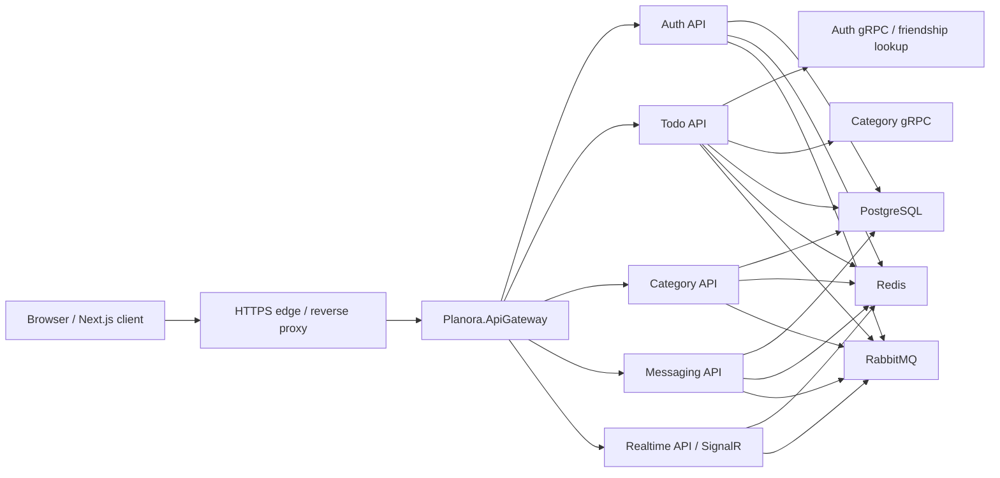

# Production Deployment Baseline

This document formalizes the production baseline for Planora. It is a deployment specification and readiness checklist based on confirmed repository artifacts, not evidence that a production environment already exists.

Confirmed artifacts:

- `docker-compose.yml` — local/container topology for backend services and infrastructure.
- `Services/*/Dockerfile` and `Planora.ApiGateway/Dockerfile` — backend image build contexts.
- `Planora.ApiGateway/ocelot.Docker.json` — gateway routing by Docker service names.
- `.github/workflows/ci.yml` — validation CI.
- `.github/workflows/e2e.yml` — Docker-backed Playwright e2e workflow for auth/todos/sharing/hidden.
- `.env.production.example` — production secret/config key template.

Not found in the repository:

- Kubernetes manifests, Helm chart, Terraform, Pulumi, CloudFormation, Ansible, or systemd units.
- Production reverse-proxy config for Nginx, Traefik, Caddy, Envoy, or a cloud load balancer.
- Automated deployment workflow that pushes images or promotes releases.

## Target Runtime Shape



## Required Production Decisions

| Area | Required decision | Repository evidence |
|---|---|---|
| Hosting | Choose the runtime platform for backend containers and frontend Next.js. | Dockerfiles exist for backend/gateway; frontend is not in `docker-compose.yml`. |
| TLS | Terminate HTTPS before the gateway and frontend. | Auth cookie `Secure` depends on `HttpContext.Request.IsHttps` in `AuthenticationController.cs`. |
| Secrets | Store secrets in a managed secret store, not in committed files. | `docker-compose.yml` requires secret interpolation; `.env.example` and `.env.production.example` are templates only. |
| Network exposure | Keep PostgreSQL, Redis, RabbitMQ AMQP, and internal service ports private. | Compose exposes local infra ports for development convenience. |
| Database schema | Decide whether production uses generated migrations or the first-run model bootstrap path. | `DatabaseStartup.EnsureReadyAsync` applies migrations when present and falls back to `EnsureCreatedAsync` when none exist. |
| Backups | Define PostgreSQL backup, restore, and retention policy. | PostgreSQL stores four service databases. |
| Observability | Define logs/metrics/traces sinks and alerting. | Services use logging/health checks; no production sink config is committed. |
| Rollback | Version images and define rollback behavior around DB migrations. | CI validates but does not deploy or promote images. |

## Minimal Production Checklist

- Build immutable images for `api-gateway`, `auth-api`, `todo-api`, `category-api`, `messaging-api`, and `realtime-api`.
- Host the frontend separately or add a production frontend image/process.
- Inject all required secrets from a secret manager or CI/CD secret store.
- Use one identical JWT signing secret across gateway and every backend service.
- Set `ASPNETCORE_ENVIRONMENT=Production`.
- Set `NEXT_PUBLIC_API_URL` and `NEXT_PUBLIC_API_GATEWAY_URL` to the public gateway origin.
- Set `Frontend__BaseUrl` to the public frontend origin so email verification links point to the right UI.
- Configure real email delivery for Auth API if users must receive verification/reset emails. For Gmail SMTP set `Email__Provider=GmailSmtp`, `Email__Username`, and `Email__Password` as secrets; keep `Email__Password` out of committed files.
- Set CORS using `Cors__AllowedOrigins__0`, `Cors__AllowedOrigins__1`, and so on.
- Expose only the HTTPS edge publicly; keep databases, cache, broker, gRPC, and service-to-service HTTP private.
- Verify gateway health endpoints after deployment:

```bash
curl -fsS https://api.example.com/health
curl -fsS https://api.example.com/auth/health
curl -fsS https://api.example.com/categories/health
curl -fsS https://api.example.com/todos/health
curl -fsS https://api.example.com/messaging/health
curl -fsS https://api.example.com/realtime/health
```

## Image Build Order

The backend Dockerfiles build from the repository root. A deployment pipeline should build from the same root context:

```bash
docker build -f Planora.ApiGateway/Dockerfile -t planora/api-gateway:<version> .
docker build -f Services/AuthApi/Planora.Auth.Api/Dockerfile -t planora/auth-api:<version> .
docker build -f Services/CategoryApi/Planora.Category.Api/Dockerfile -t planora/category-api:<version> .
docker build -f Services/TodoApi/Planora.Todo.Api/Dockerfile -t planora/todo-api:<version> .
docker build -f Services/MessagingApi/Planora.Messaging.Api/Dockerfile -t planora/messaging-api:<version> .
docker build -f Services/RealtimeApi/Planora.Realtime.Api/Dockerfile -t planora/realtime-api:<version> .
```

`<version>` should be a release tag or immutable commit SHA. Do not deploy mutable `latest` tags as the rollback target.

## Schema And Migration Policy

Confirmed behavior: Auth, Todo, Category, and Messaging initialize schema during startup. If EF migrations exist in the service assembly, startup applies pending migrations. If no migrations exist, startup creates schema from the current EF model.

The repository ignores generated `Migrations/` folders by policy, so forks/installations can own their migration history. Production owners should choose one policy:

| Policy | When to use | Tradeoff |
|---|---|---|
| First-run model bootstrap | Local Docker installs and throwaway environments without migration files. | Fast and simple; not an auditable migration history. |
| Startup migrations | Small controlled deployments where only one instance starts migrations at a time. | Simpler, but can race during multi-replica rollouts. |
| Pre-deploy migration job | Production/staging environments with multiple replicas. | More explicit and safer, but requires a separate migration runner. |

For production, prefer generating service-owned migrations and running them through a controlled deployment step. If using pre-deploy migration jobs, review startup schema behavior before enabling multi-replica automatic rollout.

Code references:

- `Services/AuthApi/Planora.Auth.Api/Program.cs`
- `Services/TodoApi/Planora.Todo.Api/Program.cs`
- `Services/CategoryApi/Planora.Category.Api/Program.cs`
- `Services/MessagingApi/Planora.Messaging.Api/Program.cs`
- `BuildingBlocks/Planora.BuildingBlocks.Infrastructure/Persistence/DatabaseStartup.cs`

## Release Verification

After deployment:

1. Run health checks through the public gateway.
2. Register a temporary user through the frontend.
3. Confirm email verification link generation uses the production frontend origin.
4. Login and confirm the refresh token is stored only as an httpOnly cookie.
5. Create categories and todos.
6. Verify shared todo hidden viewer behavior with an accepted friend account.
7. Check logs for unhandled exceptions, failed gRPC calls, and RabbitMQ connection errors.

The automated CI equivalent for the critical sharing/hidden path is `frontend/e2e/auth-todos-sharing-hidden.api.spec.ts`.

## Rollback Guidance

The repository does not include an automated rollback workflow. A production deployment should define:

- immutable image tags for every service;
- a compatible database migration plan for each release;
- backup before irreversible migrations;
- rollback order for gateway, services, and frontend;
- smoke/e2e checks after rollback.

Do not roll back application images across incompatible database migrations without a tested restore path.

## Production Gaps To Track

| Gap | Why it matters |
|---|---|
| No production frontend deployment target | Users need a defined Next.js hosting strategy. |
| No reverse-proxy/TLS config | Cookies, CORS, WebSocket forwarding, and HTTPS behavior depend on the edge. |
| No deployment workflow | CI validates but does not publish or promote images. |
| No secret manager integration | Production should not depend on a plaintext `.env` file. |
| No backup/restore playbook | PostgreSQL is the durable system of record. |
