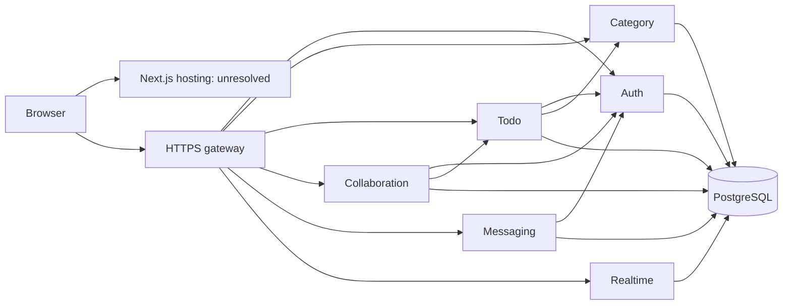

# Production Deployment Baseline

This is a release specification and acceptance checklist based on repository
artifacts. It does not assert that the current checkout has been deployed or
that its configured infrastructure accounts exist. The [2026-10-06 audit](audits/2026-10-06.md)
records concrete code, migration and workflow gaps that must be resolved first.

## Committed target and missing pieces

The selected backend platform is Fly.io. Nine manifests, app creation and
secret staging scripts, a migration CLI and `.github/workflows/cd.yml` are
committed. The CD workflow requests blue/green service deployments after a
migration step, then gateway deployment and health smoke. There is no committed
production frontend target, Kubernetes/Helm or Terraform stack, complete
database restore drill, or separate outbox-worker implementation.

```mermaid
flowchart LR
    browser[Browser] --> frontend[Next.js hosting: unresolved]
    browser --> gateway[HTTPS gateway]
    gateway --> auth[Auth]
    gateway --> category[Category]
    gateway --> todo[Todo]
    gateway --> collaboration[Collaboration]
    gateway --> messaging[Messaging]
    gateway --> realtime[Realtime]
    todo --> auth
    todo --> category
    collaboration --> auth
    collaboration --> todo
    messaging --> auth
    auth --> pg[(PostgreSQL)]
    category --> pg
    todo --> pg
    collaboration --> pg
    messaging --> pg
    realtime --> pg
```

The diagram shows logical API/data relationships; actual network exposure,
TLS, listener protocols, private addressing, Redis and RabbitMQ dependencies
must be validated from effective deployment configuration.

## Required runtime configuration

| Area | Acceptance requirement | Source |
|---|---|---|
| Public origins | Concrete frontend/gateway HTTPS origins; frontend API values fixed at build time | `frontend/next.config.js`, `frontend/src/lib/config.ts` |
| Cookie transport | HTTPS and Auth `Security:RequireHttps` enabled/default-secure | `AuthenticationController.cs` |
| Identity | Identical issuer, audience and JWT signing secret at gateway/services | `JwtAuthenticationExtensions.cs`, service startup |
| Internal RPC | Shared service key; working Auth/Category/Todo HTTP/2 endpoints | `GrpcContracts/Protos`, gRPC clients/interceptors |
| Listener ports | Effective Kestrel endpoints match Fly internal ports | Service `appsettings.json`, `deploy/fly/*.fly.toml` |
| Gateway routes | Production Ocelot targets point to actual service hosts | `Planora.ApiGateway/Program.cs`, route files |
| Databases | Six separately owned schemas/databases when durable Realtime is enabled | `docs/database.md` |
| Distributed limiting | Configure Redis in services; account for gateway in-memory limiter and middleware order | `docs/auth-security.md` |
| CORS | Explicit frontend allow-list; no development LAN wildcard assumption | Gateway/service startup |
| Forwarded headers | Gateway known-proxy array of literal IP addresses; current parser does not accept CIDR | `Planora.ApiGateway/Program.cs` |
| Email | SMTP provider/credentials/sender and correct `Frontend__BaseUrl` | Auth EmailOptions/EmailService |
| Uploads | Persistent and writable storage at the path the avatar writer actually uses | Auth profile-picture handlers, `auth.fly.toml` |
| Monitoring | Compatible OTLP endpoint/protocol and optional Loki; collector access controls | `docs/observability.md` |

Use [Configuration](configuration.md) and [Secrets](secrets-management.md) for
key names. Example env files are not secret stores and are not automatically
applied by Fly. `Start-Planora-Local.ps1 -Prod` is a LAN simulation which disables
secure-cookie enforcement for plain HTTP; it is not a production deployment recipe.

## Database rollout acceptance

1. Resolve the missing initial Todo migration and validate a clean database.
2. Establish a tracked migration history for services currently bootstrapped by
   `EnsureCreatedAsync`; an existing model-created database needs a deliberate
   baseline strategy. Do not equate model creation with schema upgrades.
3. Repair and build the migrator Docker image with all six project dependencies.
4. Provide every selected connection string, including Realtime, to the runner.
5. Run `--all --list-pending` against the intended environment, inspect migration
   IDs and SQL artifacts, then apply the reviewed release.
6. Verify application/schema compatibility before admitting traffic. Startup
   migrations remain active in five service hosts; CD has not disabled them.
7. Keep backup/restore evidence and a tested forward-fix or compatible image
   rollback path. The runner's missing-history guard is not a model drift audit.

See [Deployment blockers](deployment.md#confirmed-rollout-blockers) and
[Database governance](database.md). The migration artifact job itself currently
needs tool/build/matrix corrections; its existence is not proof of valid SQL.

## Release verification

Before promotion, record image/ref, effective non-secret settings, migration
IDs, test reports, operator and observation window. Successful health responses
are necessary but insufficient, particularly for the empty gateway/Realtime
health-check registrations.

- Probe every host and gateway service alias; inspect service logs.
- Exercise register, verification link, login, refresh, logout and revocation.
- Confirm cookies and CSRF behavior on the chosen real origins.
- Create category/task and validate list/detail/update persistence.
- Exercise owner, accepted friend, unrelated user, hidden viewer and revoked
  participant cases using the [authorization audit](security-idor-coverage.md).
- Validate comments/replies/subtasks, notification REST reads and SignalR push.
- Validate avatar upload/static serving after restart and after a new deploy.
- Confirm actual trace/log/metric arrival and inspect collector label names.
- Confirm database backup restoration in an isolated environment.

The audit identified access-check gaps and two failing backend password-reset
tests. Those remain application/test work; documentation changes do not close
them or establish release readiness.

## Rollback and incident handling

Use immutable release references/images. Blue/green service deployment does
not roll back database changes, secrets, uploads or a frontend deployed
elsewhere. Document the last compatible schema/image pair, required restore
procedure, credentials rotation impact and verification steps before promoting.
CD has no dedicated manual rollback workflow. Dispatching an older ref is a
new deployment and still runs the migrator unless explicitly skipped; inspect
schema compatibility before doing so.

## Outstanding production decisions

| Decision / gap | Evidence needed to close it |
|---|---|
| Next.js hosting and deployment | Working build/start, origin config, TLS and deploy rollback |
| Fly public/private service exposure | Allocated addresses and verified effective networking; manifest comments are insufficient |
| Avatar persistence path | Upload/redeploy/serve test against the mounted volume |
| PostgreSQL backup and retention | Provider policy plus successful restore drill |
| Operational dashboards and SLOs | Exported metric samples, deployed rules and routing of alerts |
| Worker extraction | Implemented worker project and controlled ownership transfer; current manifest is reserved |
| Authorization and event reliability gaps | Reviewed code/test changes addressing the audit findings |
